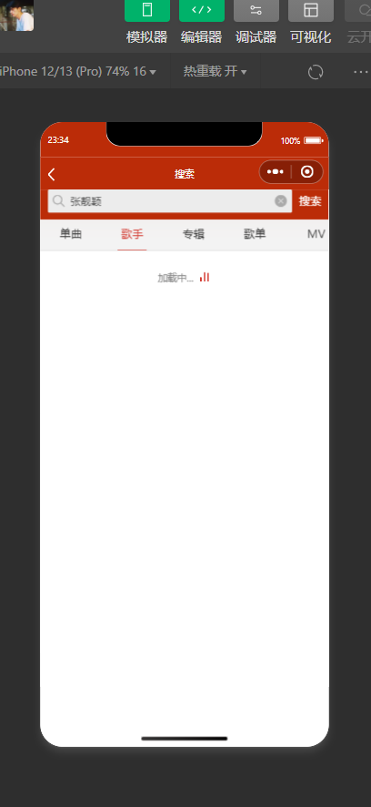
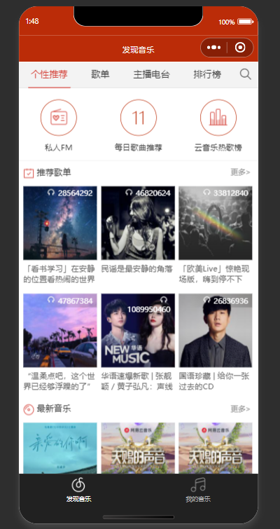

<!--by 梁旭东 -->
# Project Introduction
This is a music player application developed as a WeChat mini-program, inspired by NetEase Cloud Music, offering users a convenient and personalized music experience. It integrates various features, including music playback, personalized recommendations, playlist management, search, comments, and sharing.

<!--by 梁旭东 -->
## Project Characteristics
Main Functions:

Music playback: Supports playing, pausing, and switching songs, displays lyrics in real-time, and allows users to adjust playback progress.

Personalized recommendations: Suggests suitable songs, playlists, and radio programs based on the user's listening history and preferences.

Playlist management: Users can create, edit, and share their own playlists, as well as add or remove songs.

Search function: Supports various types of searches (songs, artists, albums, etc.), saves search history, and offers intelligent suggestions.

User interaction: Users can comment on songs, playlists, and music videos, as well as like and save their favorite content.

Radio and Music Videos: We provide a wide selection of radio programs and high-definition music videos, supporting online playback and user comments.

<!-- by Meng YiXin -->
# Project Installation

### (1) Clone the Project

a. Main Project
```bash
git clone https://github.com/TMyxGames/NeteaseMusicWxMiniApp.git
```

b. Backend Project
```bash
git clone https://github.com/TMyxGames/netmusic-node.git
```

### (2) Install Node.js

a. Download Address:https://nodejs.org/en/

b. Check Installation
```bash
node -v
```

### (3) Launch the Backend Project

a. Open the terminal and switch the working path to the backend project folder

b. Enter
```bash
npm i
node app.js
```
### (4) Open the Main Project

In ```Details > Local Settings```, choose ```Do not verify legal domain, web-view (business domain), TLS version, and HTTPS certificate```

### (5) Compile the Project

<!-- by 梁旭东 -->
# Project Structure 
NETEASEMUSICWXMINI/
│
├── ai_usage_screenshots/   AI使用截图
│
├── image/   软件图片
│
├── page/   主要代码
│
├── picture/  项目主要介绍使用截图
│
├── screenshot/  音乐图片
│
├── utils/
│
├── app.js
├── app.json
├── app.wxss
├── LICENSE
├── modification_log.md   AI使用记录
├── README.md   英文版本
├── README.zh.md  中文版
└── terms.md  术语表

# Project main function description and screenshots

<!--by 梁旭东 -->
Music playing interface

Play music: Use the playmusic function to request music details and play them.


The main function of the playing file: index.js is to implement a music player page.

Play mode switch: Use playshuffle function to switch play mode (sequential play, single loop, random play).


Playlist management: Users can add the currently playing songs to their playlist.

record file: index.js is the main function of implementing a music playing record page.

playlist file: index.js is a playlist detail page.


Comment loading: Load the song comments via the common.loadrec function.

recommend file: index.js is a review page.


<!-- by Meng Yixin -->
### music player


The core functionality of the music player, including obtaining music information, playback control, sharing, and page navigation.

index.js
    Defines the data structure and methods, implementing the functionality of the music playback page.
    Use the common.toggleplay method to control the playback and pause of music.

index.wxml
    Implements the appearance of the music playback page.

index.wxss
    Defines the component styles of the music playback interface.

### artist


The artist details page functionality, including artist information, works, albums, and music videos (MVs).

index.js
    Defines the data structure and methods, implementing the functionality of the artist details page.

index.wxml
    Implements the appearance of the artist details page.

index.wxss
    Defines the component styles of the artist details page.

### cloud
The cloud disk functionality, used to display the list of music stored in the user's cloud disk.

index.js
    Defines the data structure and methods, implementing the cloud disk functionality.

index.wxml
    Implements the appearance of the cloud disk page.

index.wxss
    Defines the component styles of the cloud disk page.

### djradio


The radio station details page functionality, including radio station information, program list, and playback control.

index.js
    Defines the data structure and methods, implementing the operational logic of the radio station details page.

index.wxml
    Implements the appearance of the radio station details page.

index.wxss
    Defines the component styles of the radio station details page.

### fm


The private FM functionality, supporting song recommendations based on user preferences and playback control.

index.js
    Defines the data structure and methods, implementing the operational logic of the private FM playback page.

index.wxml
    Implements the appearance of the private FM playback page.

index.wxss
    Defines the component styles of the private FM playback page.

<!-- by Liu Fei -->


Implemented daily recommended song list, control of music playback, and playlist management

index.js  
    Defined page data structure and event handling functions, implemented music recommendation list and music playback control

index.wxml  
    Implemented the view of music recommendation page

index.wxss  
    Defined layout structure and visual style

##  search major function 



Mainly for search function, divided into multiple types of search, search history, music playback integration, and pagination loading

index.js  
    Data definition and search logic have enabled the search function for songs

index.wxml  
    Implemented rendering of the search interface

index.wxss  
    Defined the structure and style of the search page


# simi major function



Implemented recommendation functions for similar content and related recommendation scenarios

index.js  
    The introduction of modules, definition of page data, and implementation of page loading logic have enabled recommendation functionality

index.wxml  
    Partial rendering of regions that have implemented relevant functions

index.wxss  
    Defined the structure and style of relevant recommendations

# toplist major function


We have implemented a music ranking page, which is mainly divided into two parts: the official cloud music chart and the global chart.

index.wxml  
    Partial rendering of regions that have implemented relevant functions

index.wxss  
    Defined component styles for cloud music


# user major function

This interface implements the logical level of the user's playlist page, with the main function of displaying the user's personal playlist and favorite playlists.

index.js  
    Core functions: user information acquisition, playlist loading, navigation bar title

index.wxml  
    Implemented a personal homepage page that displays user information, social data, and playlists.

index.wxss  
    Define the visual style of the user's personal homepage.

<!-- by ZhaoYu -->
### home


Application main page, primarily featuring home recommendations, song lists, radio stations, and playback controls.

### login


Logic for user login within the application, implementing a basic user authentication feature.

onLoad: Initializes data passed to it.

textinput: Monitors user input.

wx.request: Verifies user credentials during login.

### me


Functionality for managing user playlists, including retrieving subscription statistics and playlist data.

### mv


MV module of the application, responsible for displaying video detail pages, including fetching video information, switching tabbed content, and loading additional comments.

tab

Handles switching between tabs by loading content.

common.loadrec: Calls this method to fetch more comment data.

### new


Implementation of a music ranking page, featuring fetching song and album rankings from different countries, switching tabbed content, and loading more data.

Variables are defined in the data to store song and album rankings from various countries.

tabtype is used to handle tab切换 operations and load rankings for corresponding countries.

getsongs and getalbums functions fetch ranking data for songs and albums respectively, categorized by country and region.
