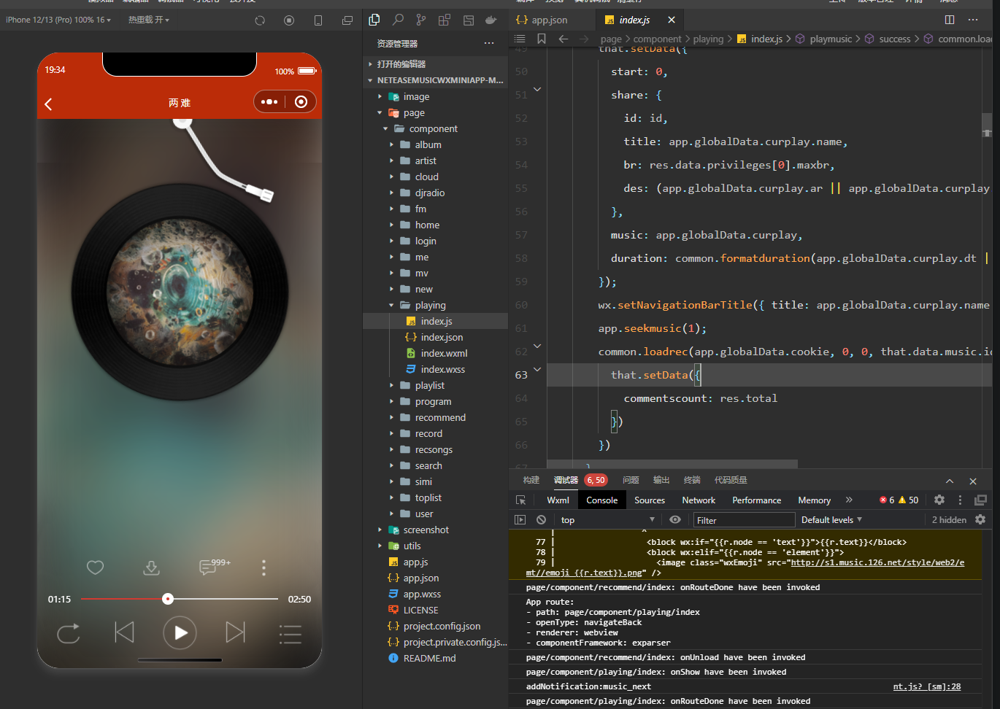
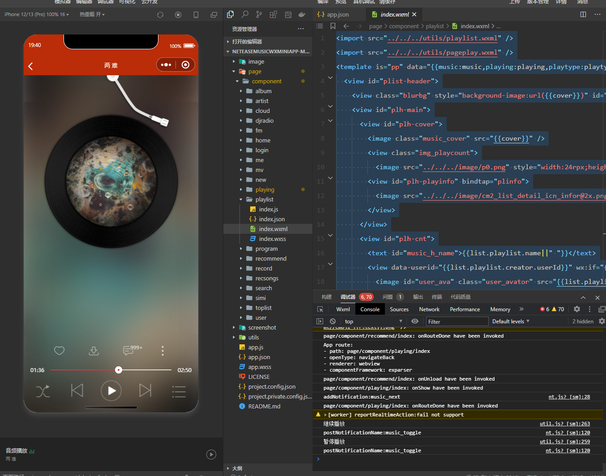
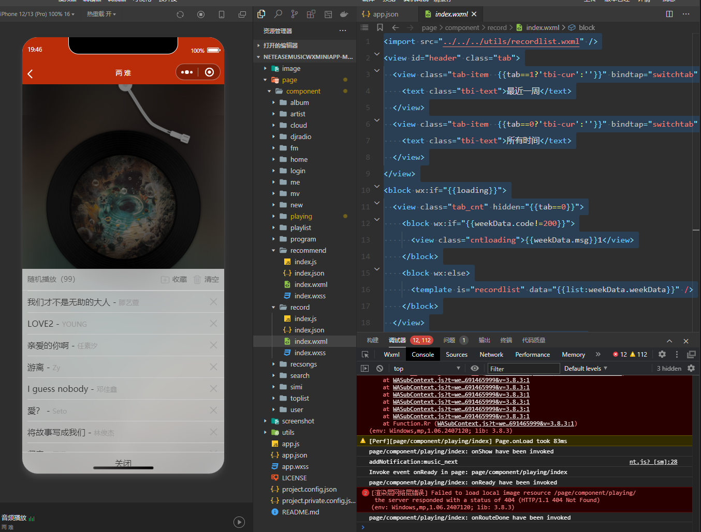
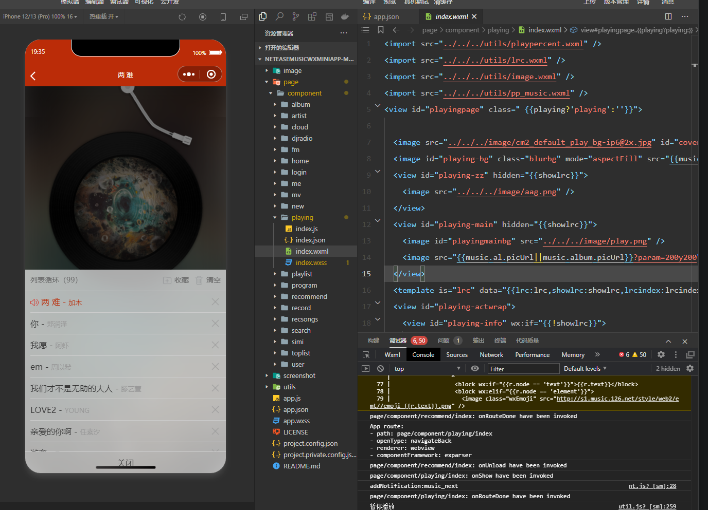
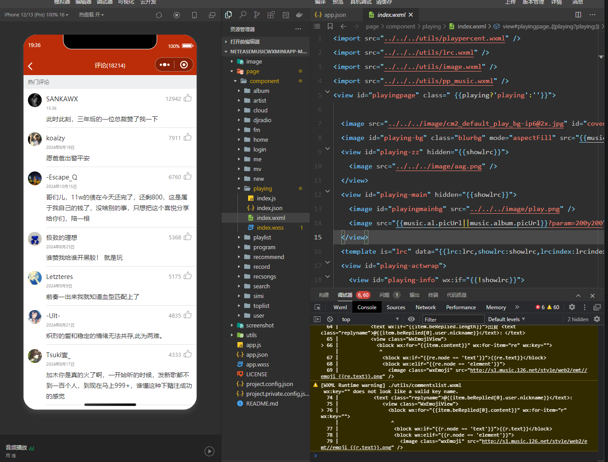
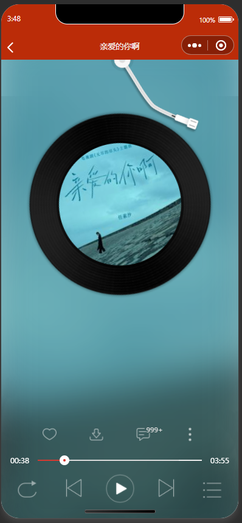
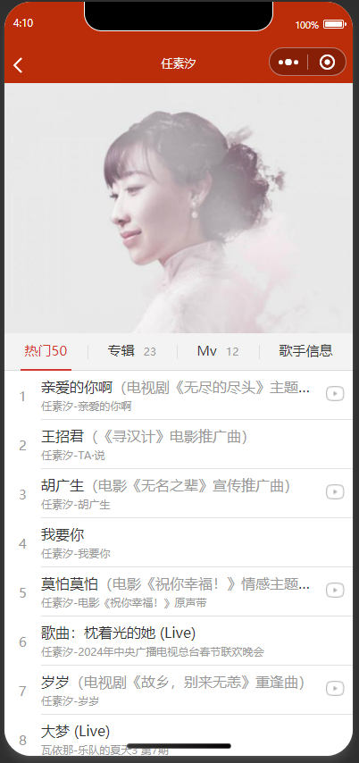
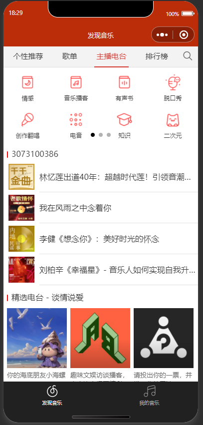

<!--by 梁旭东 -->
# Project Introduction
This is a music player application developed as a WeChat mini-program, inspired by NetEase Cloud Music, offering users a convenient and personalized music experience. It integrates various features, including music playback, personalized recommendations, playlist management, search, comments, and sharing.

<!--by 梁旭东 -->
## Project Characteristics
Main Functions:

Music playback: Supports playing, pausing, and switching songs, displays lyrics in real-time, and allows users to adjust playback progress.

Personalized recommendations: Suggests suitable songs, playlists, and radio programs based on the user's listening history and preferences.

Playlist management: Users can create, edit, and share their own playlists, as well as add or remove songs.

Search function: Supports various types of searches (songs, artists, albums, etc.), saves search history, and offers intelligent suggestions.

User interaction: Users can comment on songs, playlists, and music videos, as well as like and save their favorite content.

Radio and Music Videos: We provide a wide selection of radio programs and high-definition music videos, supporting online playback and user comments.

<!-- by Meng YiXin -->
# Project Installation

### (1) Clone the Project

a. Main Project
```bash
git clone https://github.com/TMyxGames/NeteaseMusicWxMiniApp.git
```

b. Backend Project
```bash
git clone https://github.com/TMyxGames/netmusic-node.git
```

### (2) Install Node.js

a. Download Address:https://nodejs.org/en/

b. Check Installation
```bash
node -v
```

### (3) Launch the Backend Project

a. Open the terminal and switch the working path to the backend project folder

b. Enter
```bash
npm i
node app.js
```
### (4) Open the Main Project

In ```Details > Local Settings```, choose ```Do not verify legal domain, web-view (business domain), TLS version, and HTTPS certificate```

### (5) Compile the Project

# Project main function description and screenshots

<!--by 梁旭东 -->
Music playing interface

Play music: Use the playmusic function to request music details and play them.



The main function of the playing file: index.js is to implement a music player page.

Play mode switch: Use playshuffle function to switch play mode (sequential play, single loop, random play).



Playlist management: Users can add the currently playing songs to their playlist.

record file: index.js is the main function of implementing a music playing record page.

playlist file: index.js is a playlist detail page.





Comment loading: Load the song comments via the common.loadrec function.

recommend file: index.js is a review page.



<!-- by Meng Yixin -->
### music player



The core functionality of the music player, including obtaining music information, playback control, sharing, and page navigation.

- index.js
    - Defines the data structure and methods, implementing the functionality of the music playback page.
    - Use the common.toggleplay method to control the playback and pause of music.

- index.wxml
    - Implements the appearance of the music playback page.

- index.wxss
    - Defines the component styles of the music playback interface.

### artist



The artist details page functionality, including artist information, works, albums, and music videos (MVs).

- index.js
    - Defines the data structure and methods, implementing the functionality of the artist details page.

- index.wxml
    - Implements the appearance of the artist details page.

- index.wxss
    - Defines the component styles of the artist details page.

### cloud
The cloud disk functionality, used to display the list of music stored in the user's cloud disk.

- index.js
    - Defines the data structure and methods, implementing the cloud disk functionality.

- index.wxml
    - Implements the appearance of the cloud disk page.

- index.wxss
    - Defines the component styles of the cloud disk page.

### djradio



The radio station details page functionality, including radio station information, program list, and playback control.

- index.js
    - Defines the data structure and methods, implementing the operational logic of the radio station details page.

- index.wxml
    - Implements the appearance of the radio station details page.

- index.wxss
    - Defines the component styles of the radio station details page.

### fm


The private FM functionality, supporting song recommendations based on user preferences and playback control.

- index.js
    - Defines the data structure and methods, implementing the operational logic of the private FM playback page.

- index.wxml
    - Implements the appearance of the private FM playback page.

- index.wxss
    - Defines the component styles of the private FM playback page.


