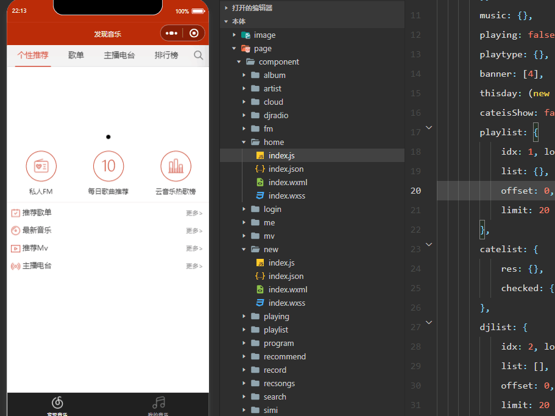
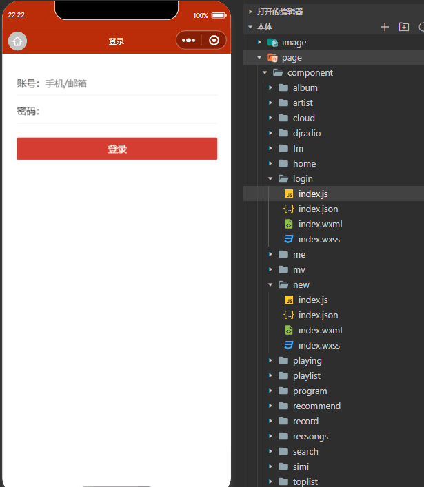
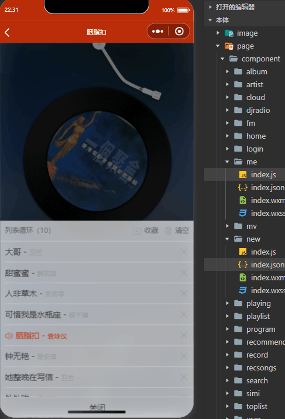
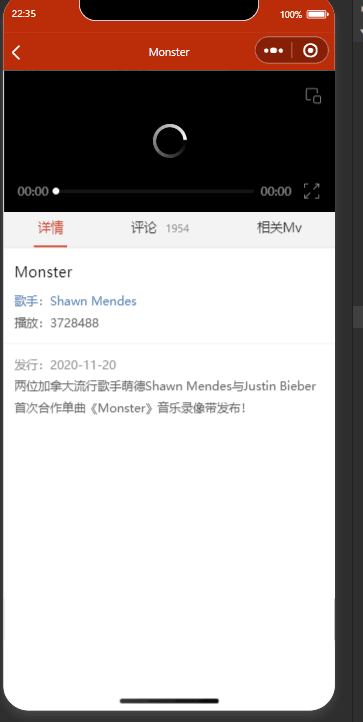
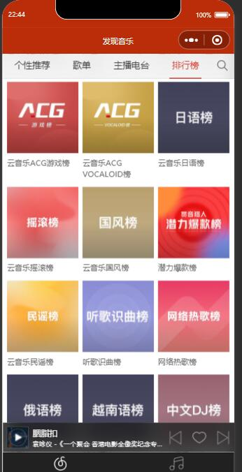

# netmusic-app
Welcome to star and issue

[中文](README.md)

A WeChat Mini Program imitating NetEase Cloud Music APP

[Use the Vue version](https://github.com/sqaiyan/neteasemusic)

Requires backend support
Download and start the [node support](https://github.com/sqaiyan/netmusic-node)to use


### Project Structure <!-- by ZhaoYu -->

```
NeteaseMusicWxMiniApp
├── image/               # Static resources
├── page/
│   ├── component/       # Page components
│       ├── album/
│       ├── artist/
│       ├── cloud/
│       ├── djradio/
│       ├── fm/
│       ├── home/
│       ├── login/
│       ├── me/
│       ├── mv/
│       ├── new/
│       ├── playing/
│       ├── playlist/
│       ├── program/
│       ├── recommend/
│       ├── record/
│       ├── recsongs/
│       ├── search/
│       ├── simi/
│       ├── toplist/
│       ├── user/
├── screenshot/          
├── utils/               # Function modules
├── app.js               
├── app.json             
├── app.wxss             
├── LICENSE
├── README.md
```


### home



Application main page, primarily featuring home recommendations, song lists, radio stations, and playback controls.


### login



Logic for user login within the application, implementing a basic user authentication feature.

1· onLoad: Initializes data passed to it.

2· textinput: Monitors user input.

3· wx.request: Verifies user credentials during login.

### me


Functionality for managing user playlists, including retrieving subscription statistics and playlist data.


### mv


MV module of the application, responsible for displaying video detail pages, including fetching video information, switching tabbed content, and loading additional comments.
Handles switching between tabs by loading content.
common.loadrec: Calls this method to fetch more comment data.

### new


Implementation of a music ranking page, featuring fetching song and album rankings from different countries, switching tabbed content, and loading more data.
Variables are defined in the data to store song and album rankings from various countries.
tabtype is used to handle tab operations and load rankings for corresponding countries.
getsongs and getalbums functions fetch ranking data for songs and albums respectively, categorized by country and region.


### Features Currently Implemented

1. User Management
2. Playlists
3. FM (Frequency Modulation Radio)
4. Playback
5. Comments
6. MVs (Music Videos)
7. Albums
8. Artists
9. Login
10. Favourite Songs, FM Trash, Saving Songs to Playlists
11. Listening History
12. Playlist Song Recommendations
13. Mini Player Bar
14. Radio and Programs
15. Search

### TODO
1. Add comments, comment likes
2. Lyrics translation
3. Collection (playlists, artists, albums, radio stations)
4. Audio quality switching
5. User activity feed, followers
6. Categorized radio stations by new songs, new releases


<image width="340" src="https://github.com/sqaiyan/NeteaseMusicWxMiniApp/raw/master/screenshot/IMG_4271.PNG"/>
<image width="340" src="https://github.com/sqaiyan/NeteaseMusicWxMiniApp/raw/master/screenshot/IMG_4279.PNG"/>
<image width="340" src="https://github.com/sqaiyan/NeteaseMusicWxMiniApp/raw/master/screenshot/IMG_4274.PNG"/>
<image width="340" src="https://github.com/sqaiyan/NeteaseMusicWxMiniApp/raw/master/screenshot/IMG_4272.PNG"/>
<image width="340" src="https://github.com/sqaiyan/NeteaseMusicWxMiniApp/raw/master/screenshot/IMG_4276.PNG"/>
<image width="340" src="https://github.com/sqaiyan/NeteaseMusicWxMiniApp/raw/master/screenshot/IMG_4277.PNG"/>
<image width="340" src="https://github.com/sqaiyan/NeteaseMusicWxMiniApp/raw/master/screenshot/IMG_4275.PNG"/>
<image width="340" src="https://github.com/sqaiyan/NeteaseMusicWxMiniApp/raw/master/screenshot/IMG_4273.PNG"/>

### If this example helps you learn WeChat Mini Programs, please buy me a cup of milk tea if possible

<image width="220" src="https://github.com/sqaiyan/NeteaseMusicWxMiniApp/raw/master/screenshot/wx.jpg"/><image width="220" src="https://github.com/sqaiyan/NeteaseMusicWxMiniApp/raw/master/screenshot/zfb.jpg"/>
