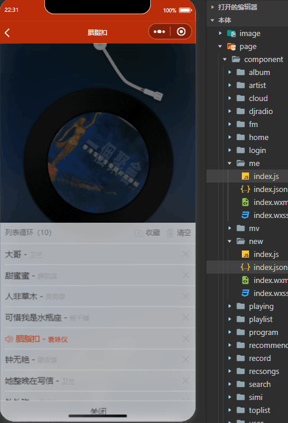

### 项目结构 <!-- by 赵宇 -->

```
NeteaseMusicWxMiniApp
├── image/               # 静态资源
├── page/
│   ├── component/       # 页面组件
│       ├── album/
│       ├── artist/
│       ├── cloud/
│       ├── djradio/
│       ├── fm/
│       ├── home/
│       ├── login/
│       ├── me/
│       ├── mv/
│       ├── new/
│       ├── playing/
│       ├── playlist/
│       ├── program/
│       ├── recommend/
│       ├── record/
│       ├── recsongs/
│       ├── search/
│       ├── simi/
│       ├── toplist/
│       ├── user/
├── screenshot/          # 截图
├── utils/               # 函数模块
├── app.js               # 主入口
├── app.json             
├── app.wxss             
├── LICENSE
├── README.md
```


### 主要功能截图 <!-- by 赵宇 -->

### home


应用主页面，主要功能为首页推荐，歌单列表，电台，播放控制


### login


应用的登录逻辑,实现了简单的用户登录功能
* onLoad:初始化传入的数据
* textinput:监听用户输入
* wx.request:登录验证


### me



用户播放列表管理功能，包括获取用户的订阅统计和播放列表数据


### mv


应用的MV模块，实现视频详情页面，包括获取视频信息、切换标签页显示不同内容以及加载更多评论的功能
* tab 处理标签页切换加载
* common.loadrec 调用该方法获取更多评论数据


### new


实现音乐排行榜页面，包括获取不同国家的歌曲和专辑排行榜数据、切换标签页显示不同内容以及加载更多内容的功能
* 在data中定义了变量来存储不同国家的歌曲和专辑排行榜
* tabtype用于处理标签页切换操作并加载相应国家的排行榜数据
* getsongs 和 getalbums 函数分别用于获取歌曲和专辑的排行榜数据，并根据国家和地区进行分类