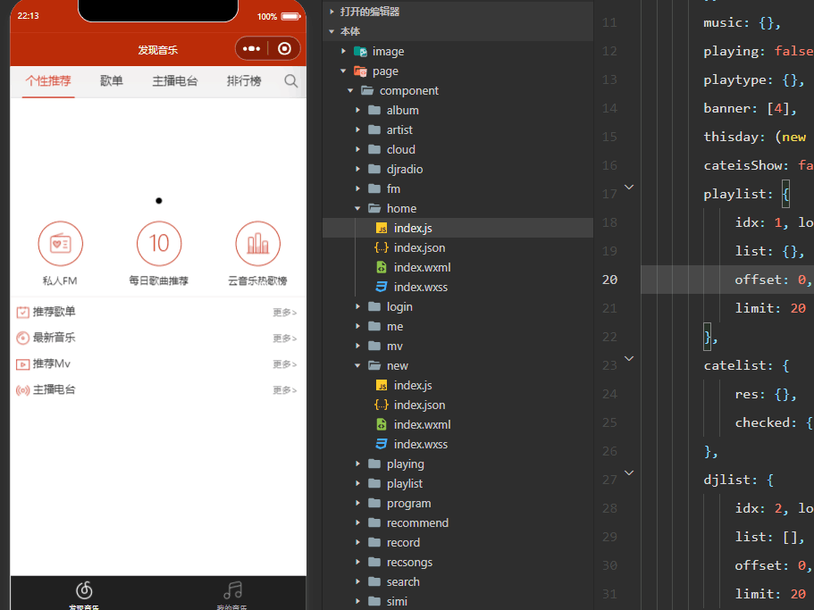

<!-- by 梁旭东 -->
# 项目介绍
这是一个基于微信小程序开发的音乐播放应用，模仿网易云音乐的小程序，在为用户提供一个便捷、个性化的音乐体验平台。它集成了音乐播放、个性化推荐、歌单管理、搜索、评论和分享等多种功能。

<!--by 梁旭东 -->
## 项目特点
主要功能：
音乐播放：支持播放、暂停、切换歌曲，实时显示歌词，调整播放进度。

个性化推荐：根据用户的听歌历史和偏好，推荐适合的歌曲、歌单和电台节目。

歌单管理：用户可以创建、编辑和分享自己的歌单，添加或删除歌曲。

搜索功能：支持多类型搜索（歌曲、歌手、专辑等），保存搜索历史，提供智能提示。

用户互动：用户可以对歌曲、歌单、MV等发表评论，点赞和收藏喜欢的内容。

电台和MV：提供丰富的电台节目和高清MV，支持在线播放和评论。

<!-- by 蒙一鑫 -->
# 项目安装与启动

### (1) 克隆项目

a. 主项目
```bash
git clone https://github.com/TMyxGames/NeteaseMusicWxMiniApp.git
```

b. 后端项目
```bash
git clone https://github.com/TMyxGames/netmusic-node.git
```

### (2) 安装Node.js

a. 下载地址:https://nodejs.org/en/

b. 检查安装
```bash
node -v
```

### (3) 启动后端

a. 打开终端并切换工作路径到后端文件夹

b. 输入
```bash
npm i
node app.js
```
### (4) 打开主项目

在 ```详情 > 本地设置``` 中勾选 ```不校验合法域名、web-view（业务域名）、TLS版本及HTTPS证书```

### (5) 编译项目

<!-- by 赵宇 -->
# 项目结构

```
NeteaseMusicWxMiniApp
├── image/               # 静态资源
├── page/
│   ├── component/       # 页面组件
│       ├── album/
│       ├── artist/
│       ├── cloud/
│       ├── djradio/
│       ├── fm/
│       ├── home/
│       ├── login/
│       ├── me/
│       ├── mv/
│       ├── new/
│       ├── playing/
│       ├── playlist/
│       ├── program/
│       ├── recommend/
│       ├── record/
│       ├── recsongs/
│       ├── search/
│       ├── simi/
│       ├── toplist/
│       ├── user/
├── screenshot/          # 截图
├── utils/               # 函数模块
├── app.js               # 主入口
├── app.json             
├── app.wxss             
├── LICENSE
├── README.md
```

# 项目主要功能说明和截图

<!-- by 梁旭东-->
音乐播放界面

播放音乐：通过playmusic函数请求音乐详情并播放。


playing文件：index.js主要功能是实现一个音乐播放器的页面。

播放模式切换：通过playshuffle函数切换播放模式（顺序播放、单曲循环、随机播放）。


歌单管理：用户可以将当前播放的歌曲添加到自己的歌单中。

record文件：index.js主要功能是实现一个音乐播放记录页面。

playlist文件： index.js主要功能是实现一个歌单详情页面。


评论加载：通过common.loadrec函数加载歌曲评论。

recommend文件：index.js主要功能是实现一个评论页面。


<!-- by 蒙一鑫 -->
### 播放器页面


音乐播放器的核心功能，包括获取音乐信息、播放控制、分享和页面跳转

- index.js  
    - 定义了数据结构和方法，实现了音乐播放页面的功能
    - 调用了common.toggleplay方法控制音乐的播放和暂停

- index.wxml  
    - 实现了音乐播放页面的外观

- index.wxss  
    - 定义了音乐播放界面的组件样式

### 歌手详情页


歌手详情页面功能，包括歌手信息、歌手作品、专辑以及MV

- index.js  
    - 定义了数据结构和方法，实现了歌手详情页面的功能

- index.wxml  
    - 实现了歌手详情页面的外观

- index.wxss  
    - 定义了歌手详情页面的组件样式

### 云盘

云盘功能，用于展示用户在云盘中储存的音乐列表

- index.js  
    - 定义了数据结构和方法，实现了云盘的功能

- index.wxml  
    - 实现了云盘页面的外观

- index.wxss  
    - 定义了云盘页面的组件样式

### 电台


电台详情页面功能，包括电台信息、电台节目列表以及播放控制

- index.js  
    - 定义了数据结构和方法，实现了电台详情页面功能的操作逻辑

- index.wxml  
    - 实现了电台详情页面的外观

- index.wxss  
    - 定义了电台详情页面的组件样式

### 私人fm


私人FM功能，支持根据用户喜好推荐歌曲以及播放控制

- index.js  
    - 定义了数据结构和方法，实现了私人FM播放页面功能的操作逻辑

- index.wxml  
    - 实现了私人FM播放页面的外观

- index.wxss  
    - 定义了私人FM播放页面的组件样式

<!-- by 刘斐 -->
## arecsongs的主要功能与截图


实现了每日推荐歌曲列表，音乐播放的控制，播放列表管理

- index.js  
    - 定义了页面数据结构和事件处理函数，实现了歌曲推荐列表音乐播放控制

- index.wxml  
    - 实现了音乐推荐页面的视图层

- index.wxss  
    - 定义了布局结构和视觉样式

# search的主要功能


主要为搜索功能，分为多类型搜索，搜罗历史，音乐播放集成和分页加载

- index.js  
    - 数据定义和搜索逻辑，实现了歌曲的搜索功能

- index.wxml  
    - 实现了搜索界面的渲染

- index.wxss  
    - 定义了搜索页面的结构和样式

# simi的主要功能


实现了相似内容的推荐功能和相关联推荐场景

- index.js  
    - 模块的引入，页面数据定义，页面加载逻辑实现了推荐功能

- index.wxml  
    - 实现了相关功能的区域部分渲染

- index.wxss  
    - 定义了相关推荐的结构和样式

# toplist主要功能


实现了展示音乐排行榜页面，主要分为云音乐官方榜和全球榜两个部分。

- index.wxml  
    - 实现了相关功能的区域部分渲染

- index.wxss  
    - 定义了云音乐的组件样式

# user主要功能

这个界面实现了用户歌单页面的逻辑层面，主要功能是展示用户的个人歌单和收藏歌单。

- index.js  
    - 核心功能用户信息获取，歌单列表加载，导航栏标题

- index.wxml  
    - 实现了个人主页页面，展示用户信息、社交数据和歌单列表。

- index.wxss  
    - 定义用户个人主页的视觉样式。

<!-- by 赵宇 -->
### home



应用主页面，主要功能为首页推荐，歌单列表，电台，播放控制

### login


应用的登录逻辑,实现了简单的用户登录功能
* onLoad:初始化传入的数据
* textinput:监听用户输入
* wx.request:登录验证

### me


用户播放列表管理功能，包括获取用户的订阅统计和播放列表数据

### mv


应用的MV模块，实现视频详情页面，包括获取视频信息、切换标签页显示不同内容以及加载更多评论的功能
* tab 处理标签页切换加载
* common.loadrec 调用该方法获取更多评论数据

### new


实现音乐排行榜页面，包括获取不同国家的歌曲和专辑排行榜数据、切换标签页显示不同内容以及加载更多内容的功能
* 在data中定义了变量来存储不同国家的歌曲和专辑排行榜
* tabtype用于处理标签页切换操作并加载相应国家的排行榜数据
* getsongs 和 getalbums 函数分别用于获取歌曲和专辑的排行榜数据，并根据国家和地区进行分类