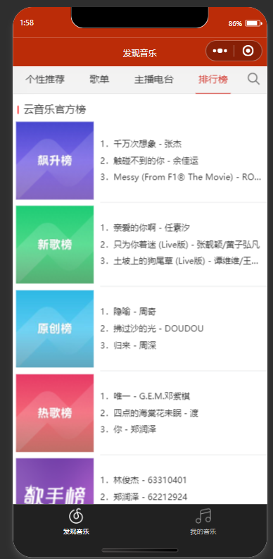

<!-- by Liu Fei -->

## Main functions and screenshots

Implemented daily recommended song list, control of music playback, and playlist management

- index.js  
    - Defined page data structure and event handling functions, implemented music recommendation list and music playback control

- index.wxml  
    - Implemented the view of music recommendation page

- index.wxss  
    - Defined layout structure and visual style

##  search major function 

Mainly for search function, divided into multiple types of search, search history, music playback integration, and pagination loading

- index.js  
    - Data definition and search logic have enabled the search function for songs

- index.wxml  
    - Implemented rendering of the search interface

- index.wxss  
    - Defined the structure and style of the search page

# simi major function

Implemented recommendation functions for similar content and related recommendation scenarios

- index.js  
    - The introduction of modules, definition of page data, and implementation of page loading logic have enabled recommendation functionality

- index.wxml  
    - Partial rendering of regions that have implemented relevant functions

- index.wxss  
    - Defined the structure and style of relevant recommendations

# toplist major function

We have implemented a music ranking page, which is mainly divided into two parts: the official cloud music chart and the global chart.

- index.wxml  
    - Partial rendering of regions that have implemented relevant functions

- index.wxss  
    - Defined component styles for cloud music

# user major function

This interface implements the logical level of the user's playlist page, with the main function of displaying the user's personal playlist and favorite playlists.

- index.js  
    - Core functions: user information acquisition, playlist loading, navigation bar title

- index.wxml  
    - Implemented a personal homepage page that displays user information, social data, and playlists.

- index.wxss  
    - Define the visual style of the user's personal homepage.